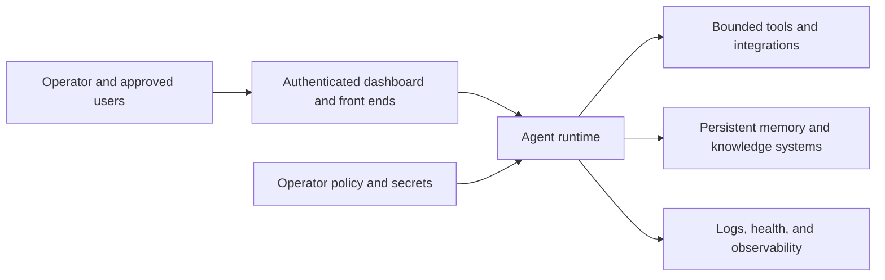

# AgentWasp

  

<strong>A self-hosted agent runtime for operators who need persistent capability without losing sight of the boundary around it.</strong>

> **Review copy only.** This proposed README is on `docs/readme-brand-draft`. It does not change `README.md`, release AgentWasp, deploy a stack, or replace the existing AgentWasp brand.

Running an agent is not the same as installing a chat app. AgentWasp brings together persistent memory, tools, integrations, observability, and a dashboard—but those capabilities need an operator who understands what is enabled, where state lives, and who can reach the system.

**Worth exploring if:** you want a self-hosted agent runtime with operational controls and documented limits, and you are prepared to run it as an operator-managed system rather than a casual one-command experiment.

## Runtime boundary

## What the runtime includes

- Containerized agent services
- Persistent memory and knowledge systems
- Integrations, logs, and monitoring
- An installer and `wasp` operational CLI
- Dashboard views for chat, tasks, memory, goals, and skills

## What remains the operator’s job

- Review every privilege, integration, and network exposure
- Protect `.env`, backups, dashboard credentials, and deployment state
- Keep dashboards behind the intended access boundary
- Verify a release installer and checksum before execution
- Test backup and recovery before relying on a long-running system

## Start with the docs, not a blind install

Read [Quickstart](docs/QUICKSTART.md), [Installation](docs/INSTALL.md), [Deployment](docs/DEPLOYMENT.md), [Security](docs/SECURITY.md), and [Status and limits](docs/STATUS_AND_LIMITS.md) before operating the stack.

The documentation describes installer, onboarding, health, backup, restore, and lifecycle paths. Before executing a remote installer, fetch it and its published SHA-256 file, verify the checksum, review the script, and use an intended private environment. Do not blindly pipe a remote installer into a shell.

## What this README does not claim

- A production-ready deployment for every environment
- A safe default exposure to the public Internet
- A substitute for reviewing provider keys, Telegram configuration, dashboard access, or enabled tools
- Automatic recovery proof merely because a backup command exists

## Project material

- [Quickstart](docs/QUICKSTART.md) · [Installation](docs/INSTALL.md) · [Deployment](docs/DEPLOYMENT.md)
- [Security](docs/SECURITY.md) · [Status and limits](docs/STATUS_AND_LIMITS.md) · [Contributing](docs/CONTRIBUTING.md)
- [Compose configuration](docker-compose.yml) · [Environment template](.env.example) · [Change log](CHANGELOG.md)

## License

Apache License 2.0. See [LICENSE.md](LICENSE.md).
