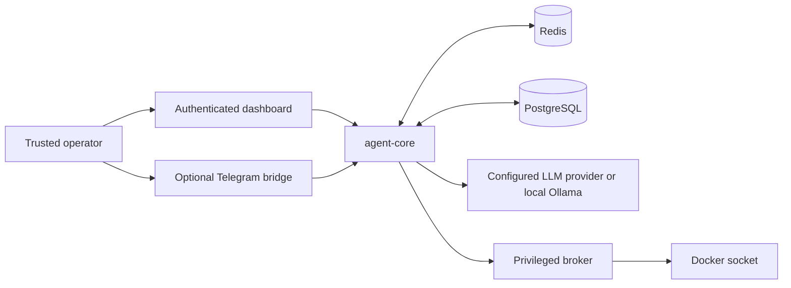

# WASP

<p align="center">
  
</p>

<p align="center"><strong>A self-hosted autonomous-agent runtime for operators who need control over access, data, and integrations.</strong></p>

> **Draft replacement only.** This branch changes neither the published README nor the release itself.

**Status:** public OSS release `v2.7.2`. Read [Status and limits](docs/STATUS_AND_LIMITS.md) for the feature-level source of truth: the dashboard, core agent surfaces, and some skills are stable; connectors and cognitive systems have Beta or Experimental boundaries.

A capable agent runtime is not a casual one-command install. WASP brings together persistent state, tools, optional integrations, and an authenticated dashboard—but a trusted operator still decides who can reach it, which credentials and integrations exist, and which privileged paths are acceptable.

**Worth exploring if:** you want to run an agent on infrastructure you control and are prepared to own the access, secrets, backup, integration, and exposure decisions that come with it.

## Authority and data boundary



The dashboard binds to loopback by default. Use a trusted TLS reverse proxy before any public exposure. Telegram is optional and should fail closed through an allowlist. The broker is privileged because it can reach the Docker socket; do not treat it as equivalent to the default agent-core boundary. Provider/API credentials and applicable requests are handled according to the integrations you configure.

## What the runtime includes

- Docker Compose services for `agent-core`, `agent-telegram`, `agent-broker`, Redis, PostgreSQL, and Ollama
- Persistent memory and knowledge systems
- An authenticated dashboard for chat, tasks, memory, goals, and skills
- Optional Telegram integration
- Installer and `wasp` operational CLI for health, status, logs, backup, restore, and lifecycle work

## Use with care

- WASP can handle provider/API credentials and, when enabled, shell, Python, file, browser, and integration capabilities.
- Keep `.env`, backup archives, dashboard credentials, and deployment state under an approved secret/access boundary.
- Review every integration and network path before enabling it.
- A backup command is not recovery proof; test restore against the matching WASP version.
- Read [Security](docs/SECURITY.md) and [Status and limits](docs/STATUS_AND_LIMITS.md) before deployment.

## Verify an installer before use

Do not blindly pipe a remote installer into a shell. Fetch the installer and its published checksum, verify it, review the script, then execute it only in an intended environment:

```bash
curl -fsSLO https://agentwasp.com/install.sh
curl -fsSLO https://agentwasp.com/install.sh.sha256
sha256sum -c install.sh.sha256
less install.sh
sudo bash install.sh
```

See [Quickstart](docs/QUICKSTART.md), [Installation](docs/INSTALL.md), and [Deployment](docs/DEPLOYMENT.md) for supported environments, onboarding, and lifecycle details.

## Dashboard proof still required

The repository has no privacy-safe, clean-demo dashboard capture committed for public README use yet. This draft deliberately uses the canonical logo and source-backed diagram rather than fabricated UI. Before a public release decision, add and visually review a clean local demo capture with no real task history, credentials, private hosts, contacts, Telegram identifiers, or customer data.

## Project material

- [Quickstart](docs/QUICKSTART.md) · [Installation](docs/INSTALL.md) · [Deployment](docs/DEPLOYMENT.md)
- [Security](docs/SECURITY.md) · [Status and limits](docs/STATUS_AND_LIMITS.md) · [Contributing](docs/CONTRIBUTING.md)
- [Compose configuration](docker-compose.yml) · [Environment template](.env.example) · [Change log](CHANGELOG.md)

## License

[Apache-2.0](LICENSE.md)
