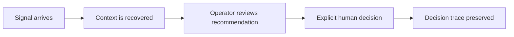

# Nexus Foundry V3 — Modern operator briefing

## What this is

A private, interface-only V3 review build for Agent Wasp V2. It begins with the **Modern** visual language of the supplied Year Wrapped v0 template, then remakes it as an operator briefing instead of a retrospective or social card.

The Retro, Gen Z, and 90s template treatments are intentionally excluded. The supplied Retro treatment is preserved in Steven's original archive for a future, separate project and is not part of this branch.

All people, agent states, recommendations, and evidence counts in this interface are fictional fixture data. No runtime has been started, queried, or changed.

## The idea

The current V2 dashboard has a powerful but wide surface. This alternative does not compete by compressing every route into another dashboard. It asks the operator to move through one clear story:



The story is deliberately quieter than a command center. It makes the decision boundary obvious and keeps the agent cast legible without suggesting that helpers own the final call.

## What carried forward from the Modern v0 template

- Generous editorial spacing, large typographic hierarchy, and softened card geometry.
- A visual narrative instead of dense utility panels.
- A small set of expressive surfaces: ink, warm paper, and soft lime.
- Responsive multi-column storytelling that collapses naturally to one column.

## What changed on purpose

- The "year wrapped" framing, creator metrics, share behavior, imported images, and public social language are gone.
- The original style selector is gone because a production operator screen should have a stable visual system, not a novelty theme switcher.
- The new content reflects observed V2 concepts: goals, agent roles, memory/context, approval, and decision traces.
- Every prominent UI statement is labeled as a fixture or describes a review state. Nothing claims a real external action.

## Running it locally

```bash
cd interface
pnpm install --frozen-lockfile
pnpm run build
pnpm dev
```

## Review status and next seam

This is a local visual prototype. It does not contain backend integration, authentication, persistent state, an agent loop, or a deployment.

If selected, the next technical step is a narrow read-model contract over existing Agent Wasp endpoints. Keep runtime truth, CSRF, authorization, approval policy, and auditing in the V2 backend. This interface should consume only sanitized presentation data and should never make a UI control look like a completed action before the backend confirms it.
