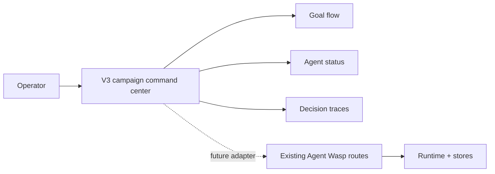

# Nexus Foundry V3 — Campaign command center

## What this is

A private, interface-only V3 review build for the existing Agent Wasp V2 dashboard. It reuses the supplied campaign-management v0 project as the visual starting point, then replaces marketing metrics with an operator command center for goals, agents, memory, evidence, and decision traces.

The screen uses fictional, static fixture data. It has no runtime API, authentication, persistence, background jobs, or external actions.

## Why this direction

V2 exposes a broad operational surface: overview, chat, models, skills, integrations, scheduler, agents, goals, tasks, memory, knowledge graph, governance, health, audit, traces, and metrics. This direction reduces that first screen to the questions an operator needs to answer quickly:

1. Is the runtime healthy?
2. What is moving right now?
3. What needs my decision?
4. What evidence led here?



## What carried forward

- A dense, responsive dashboard rhythm from the supplied campaign template.
- Glanceable cards, a strong primary work list, and a contextual side panel.
- A restrained dark surface with one amber accent used only for focus and action.
- Review-first language. Buttons are visual affordances, not claims that an action occurred.

## What changed on purpose

- Marketing terms, spend metrics, conversion claims, and live-data framing were removed.
- The primary object is a goal, not a campaign.
- The side panel explains a review boundary rather than pretending automation can act alone.
- The activity feed is a readable decision trace rather than a generic event stream.

## Running it locally

```bash
cd interface
pnpm install --no-frozen-lockfile
pnpm run build
pnpm dev
```

## Review status

This is a local visual prototype only. It must not be described as a production dashboard, a deployed replacement, or a connected WASP runtime. The integration seam is deliberately deferred until the V3 information architecture is selected.

## V3 build seam

A production implementation should keep the V2 Python/FastAPI/Jinja application as the source of runtime truth. A future adapter should map existing route data into a small, sanitized read model, then preserve CSRF, authentication, approval gates, and audit behavior at the backend boundary. The prototype does not replace those controls.
